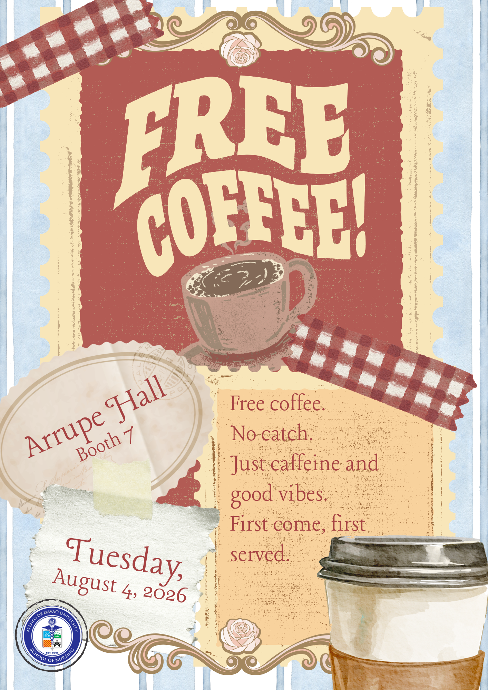
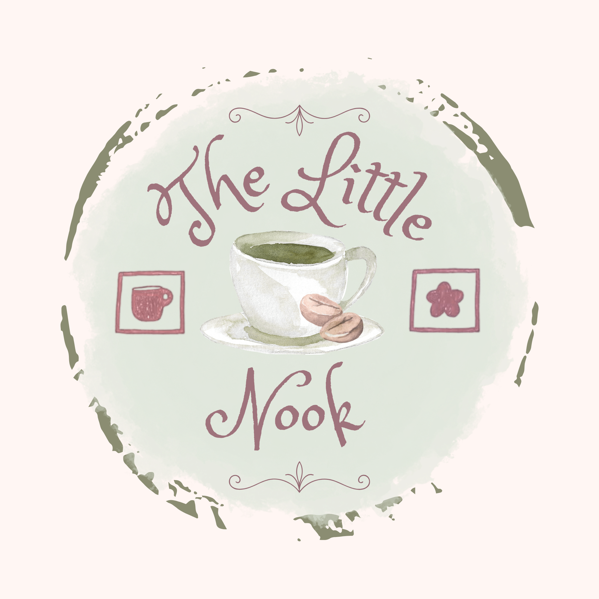
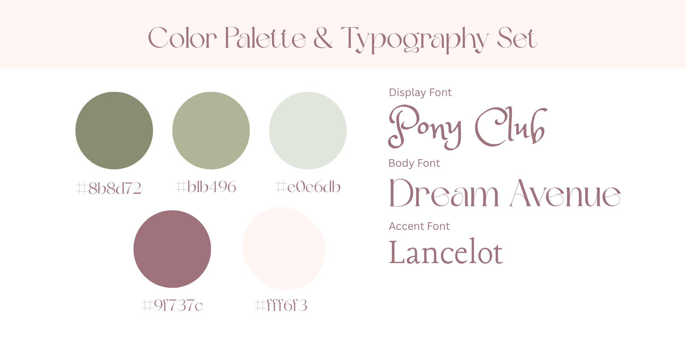
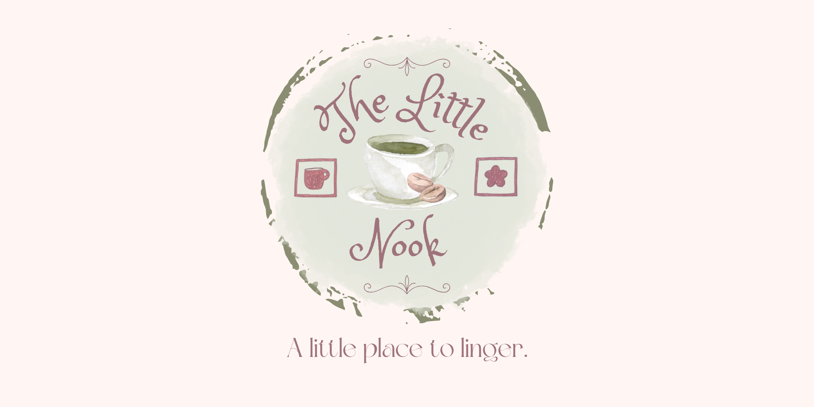
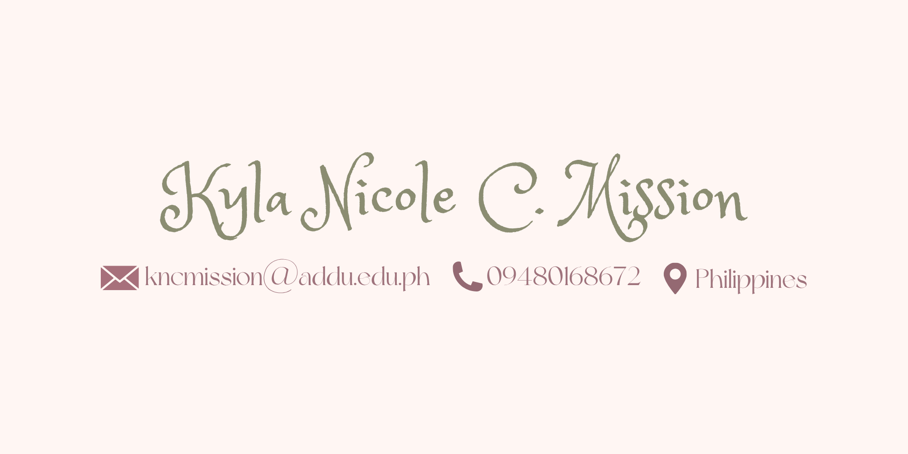
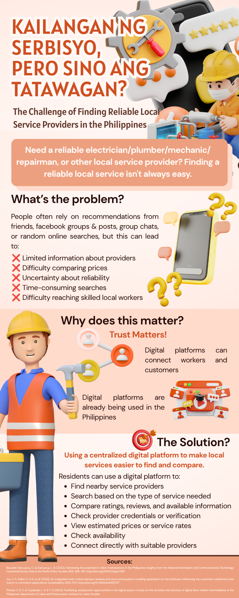

# ☕ Kyla Nicole C. Mission

### *Nursing student. Creative thinker. Problem-solver.*

📧 kncmission@addu.edu.ph &nbsp;•&nbsp; 📱 0948 016 8672 &nbsp;•&nbsp; 📍 Philippines

**BS-Nursing 4F** · Ateneo de Davao University — School of Nursing

---

## 👋 About This Portfolio

I'm a nursing student at Ateneo de Davao University, but this repository isn't about
stethoscopes and shift schedules — it's about the **GE 4120** projects that let me
step outside the ward and flex a different set of muscles: design, branding, and
problem-solving with technology.

Across three activities, I moved from *"make something people will stop and read"* →
*"build a brand people will remember"* → *"design a solution people actually need."*
Here's the journey.

| # | Activity | Skill Flexed | Format |
|---|----------|---------------|--------|
| 1 | [Free Coffee Poster](#-activity-1--free-coffee-poster-design) | Visual/graphic design, event promotion | Poster (PNG) |
| 2 | [The Little Nook — Brand Identity](#-activity-2--brand-identity-the-little-nook) | Branding, typography, color theory | Brand Kit (PDF) |
| 3 | [Neighborhood Service Finder](#-activity-3--neighborhood-service-finder) | UX research, systems thinking, proposal writing | Infographic + Documentation |

---

## 🎨 Activity 1 — Free Coffee Poster Design

**The brief:** design an eye-catching poster to promote a simple giveaway event.

**The concept:** a vintage postage-stamp aesthetic — warm reds, gingham washi tape,
and a hand-drawn coffee cup — built to feel like a cozy little "you're invited" note
rather than a corporate flyer. The tone stays playful and low-pressure, matching the
line at the bottom of the poster itself: *"Free coffee. No catch. Just caffeine and
good vibes."*

**Event details showcased:**
- 📍 Arrupe Hall, Booth 7
- 🗓️ Tuesday, August 4, 2026
- ☕ First come, first served

**Design choices:**
- Distressed, scrapbook-style layout (torn paper, tape, postal stamp die-cuts) to feel
  handmade and approachable
- A muted red-and-cream palette for warmth without looking like an ad
- Clear info hierarchy — the headline grabs attention, the location/date block answers
  the practical questions immediately

---

## 🌿 Activity 2 — Brand Identity: The Little Nook

  
  

**The brief:** design a complete visual identity for a fictional small business.

**The concept:** ***The Little Nook*** — *"a little place to linger."* A quiet,
watercolor-inspired café brand built around the idea of slowing down. Every element,
from the hand-lettered wordmark to the sage-and-mauve palette, was chosen to feel warm,
soft, and unhurried — the visual equivalent of a slow morning with a good cup of coffee.

**Brand Kit includes:**

| Element | Details |
|---|---|
| 🖋️ Logo | Watercolor cup-and-saucer emblem with hand-lettered script |
| 🎨 Color Palette | Sage green `#8b8d72`, soft olive `#b1b496`, pale mint `#e0e6db`, mauve `#9f737c`, cream `#fff6f3` |
| 🔤 Typography | Display — *Pony Club* · Body — *Dream Avenue* · Accent — *Lancelot* |
| 📇 Contact Card | Branded business-card layout for consistency across touchpoints |

The palette and type pairing were kept deliberately muted so the brand feels
handcrafted rather than mass-produced — an intentional counterpoint to the loud,
high-contrast branding most cafés lean on.

📸 See the full brand kit (tagline lockup + contact card)

 
  

---

## 🛠️ Activity 3 — Neighborhood Service Finder

*Combines both the **infographic** and the **full project documentation**.*

### The Problem
**"Kailangan ng serbisyo, pero sino ang tatawagan?"** *(You need a service, but who do
you even call?)* Filipino households routinely need an electrician, plumber, mechanic,
or repairman — but usually end up piecing together recommendations from Facebook
groups, group chats, and word-of-mouth. That process is slow, hard to compare, and
offers no real guarantee of reliability.

### The Proposed Solution
A **centralized digital platform** — the *Neighborhood Service Finder* — that lets
residents:
- 🔍 Search for nearby providers by service type
- 💸 Compare prices, ratings, and reviews in one place
- ✅ Check verification badges and credentials
- 📅 View real-time availability and send service requests
- 💬 Message providers directly to confirm scope and schedule

### Why It Matters
Drawing on research into Philippine e-commerce and digital labor platforms, the
proposal argues that **trust — not just visibility — is the real bottleneck**.
Simply listing providers online isn't enough; the platform needs credibility signals
(verification, reviews, transparent pricing) before residents will actually use it
over their existing network of "tita's contractor" recommendations.

### Full Write-Up
📄 **[Read the full project documentation](assets/activity3-project-documentation.pdf)**
— includes the complete problem description, feature breakdown, and cited references
(Bayudan-Dacuycuy & Dacuycuy, 2022; Jou et al., 2024; Pineda & Cayabyab, 2023).

---

## 🧭 Reflection

These three activities look different on the surface — a poster, a brand kit, and a
tech proposal — but they all came down to the same question: **how do you get someone
to notice, trust, and act on something?** A poster earns a glance, a brand earns
recognition, and a well-researched proposal earns belief in an idea. Working through
all three gave me a small but genuine taste of design thinking and product proposal
work outside of clinical practice.

---

*Thanks for stopping by! Feel free to reach out via the contact info above.*

